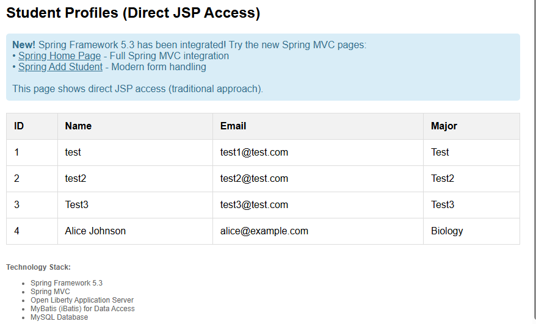

# Open Liberty Ant Project

This project is configured for Open Liberty with the following features enabled:
- localConnector-1.0
- servlet-4.0
- jsp-2.3
- transportSecurity-1.0
- jaxws-2.2
- jdbc-4.3
- jndi-1.0
- javaMail-1.6
- appSecurity-3.0
- bells-1.0

Java 11.

Architecture:


## Getting Started


## Student Profiles

1. View localhost:9080/studentProfileList to watch student profiles list



2. Add new student

```bash
curl -XPOST http://localhost:9080/addStudent?name=test&major=test&email=test@microsoft.com
```

## Docker Deployment

### Prerequisites
- Docker and Docker Compose installed
- Internet connection (for downloading MySQL connector)

### Quick Start
1. Run the setup script to prepare the environment:
   ```bash
   # Linux/Mac
   ./setup-docker.sh
   
   # Windows
   setup-docker.bat
   ```

2. Start the application and database:
   ```bash
   docker-compose up --build
   ```

3. Access the application:
   - Student Profile List: http://localhost:9080/studentProfileList
   - Add Student: http://localhost:9080/

### Manual Setup (if script fails)
1. Create `mysql-connector` directory
2. Download MySQL Connector/J 8.0.33 and place it in `mysql-connector/mysql-connector-java-8.0.33.jar`
3. Build the application: `ant clean war`
4. Run: `docker-compose up --build`

### Docker Services
- **MySQL Database**: Runs on port 3306 with database `studentdb`
- **Student Web App**: Runs on ports 9080 (HTTP) and 9443 (HTTPS)

### Environment Variables
The Docker setup uses these key environment variables:
- `JDBC_URL`: MySQL connection string
- `DB_USER`: Database username (default: `student`)
- `DB_PASSWORD`: Database password (default: `studentpass`)

### Stopping the Application
```bash
docker-compose down
```

To remove all data:
```bash
docker-compose down -v
```